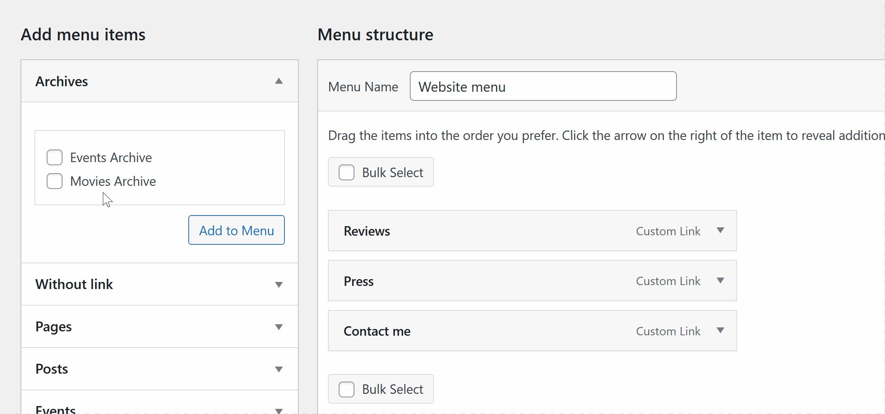

# WordPress navigation menu advanced examples

There are some examples that show you how to manipulate WordPress navigation menu items in the admin panel.

And how you can without any plugins:

## 01. add custom menu item type

The example shows how to add Archives menu item type to the nav menu edit page.

## 02. add custom menu item without link

The example shows how to add custom menu item type without link. Sometimes you need one to use as a title for nested menu levels.

## 03. add custom fields to menu item

The example shows how to add custom fields to add an icon to a menu item
In this example were used Checkbox, Text, Radio and Select fields.

## 04. add custom field for the first level items only

The example shows how to display custom fields for menu items on certain menu depth level.

## 05. add custom field for post menu items only

The example shows how to display custom fields for menu items of a certain type

## 06. add custom field for items on certain theme location

The example shows how to display custom fields for menu items only when the certain Display location checkbox is checked.

